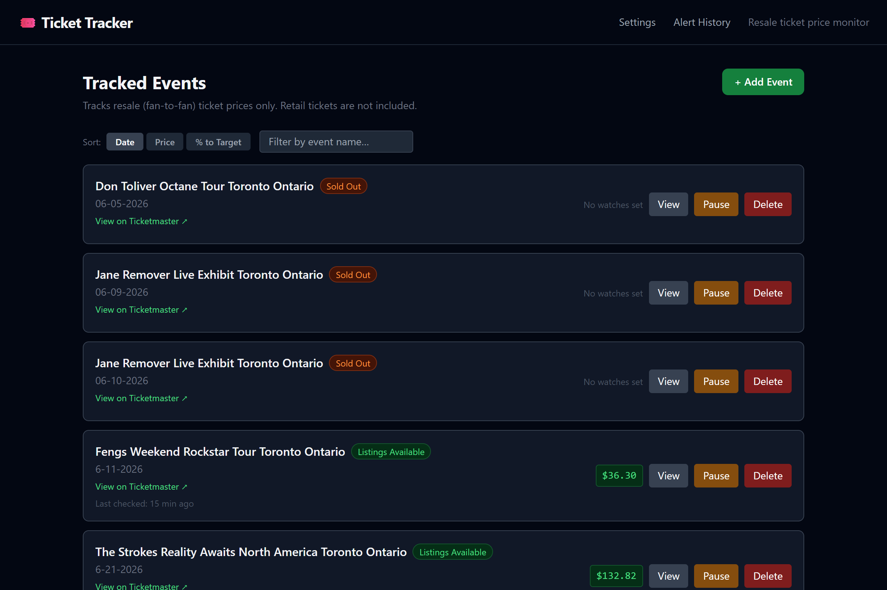
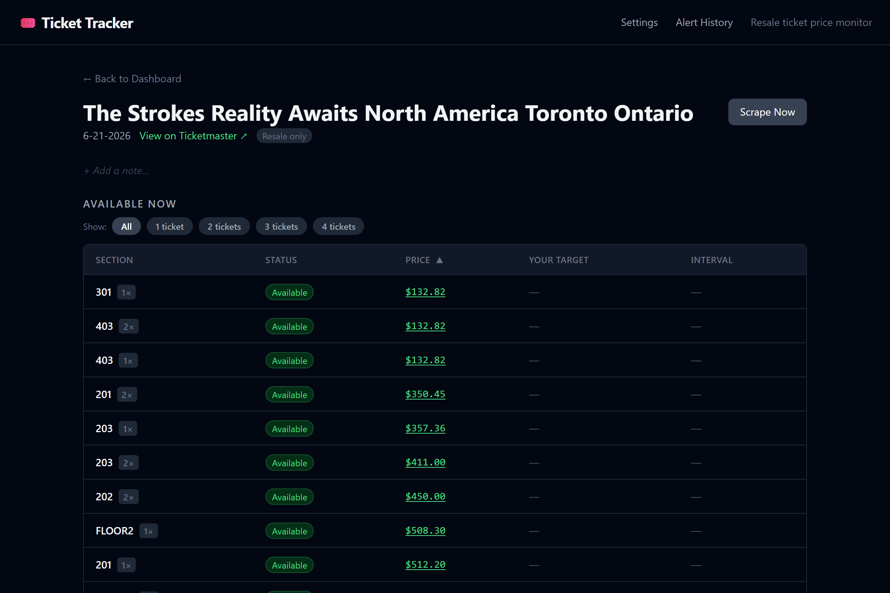
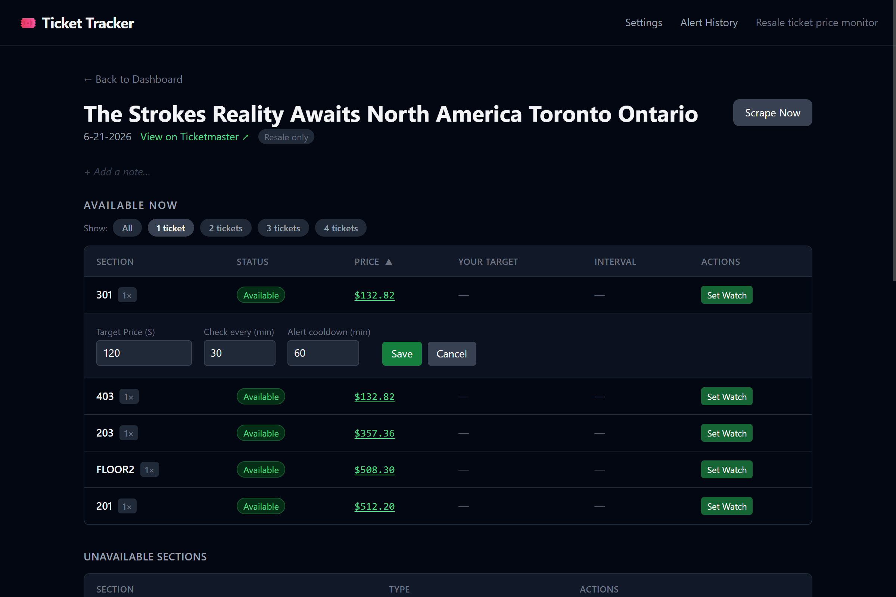
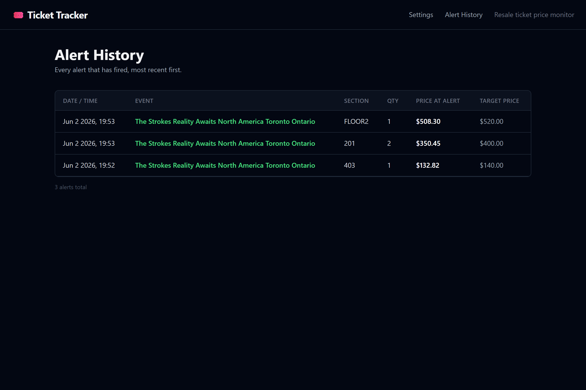

# Ticket Tracker

A self-hosted tool that watches Ticketmaster resale listings and alerts you when prices drop. Paste an event URL, set a target price, and walk away — the app polls on a schedule and emails you when it's time to buy.

> ⚠️ **Fair warning:** Scraping Ticketmaster violates their Terms of Service. This is a personal, self-hosted tool — use it at your own risk and don't be surprised if requests get blocked occasionally.

---

## What it does

Ticketmaster resale prices move constantly. Refreshing a page manually is tedious and you'll miss the dip. Ticket Tracker automates that loop:

1. You paste a resale event URL and set a target price
2. The app scrapes the listing on a schedule (minimum every 5 minutes)
3. When the price drops to or below your target, it sends an alert
4. Every price point is recorded — you get a full history chart per listing

It also handles the annoying edge cases: sold-out events, sections that vanish and reappear, event dates changing, listings disappearing between scrapes.

---

## Screenshots

### Dashboard


_All tracked events at a glance — status badges, current lowest price, and last scrape time_

### Event Detail


_Browse listings by section and quantity — set a price watch with one click_

### Set ALert


_Set your scrape intervals — Be alerted only at the price you set_

### Alert Log


_Full history of every alert fired, with price at time of alert_

---

## Features at a glance

**Event tracking**

- Add events by resale URL — scrape fires immediately on add
- Duplicate URL rejection, automatic event name + date parsing
- Sold-out events can be added and watched for any listing to appear
- Ended events detected automatically, jobs cancelled, marked as done
- Pause and resume tracking without losing history
- Per-event notes (inline edit, no reload)
- Date-change detection with badge + alert when Ticketmaster updates the date

**Price watches**

- Watch individual listings by section × quantity
- Set target price, check interval, and alert cooldown independently per watch
- Multiple watches per event on independent schedules
- Full price history recorded per listing
- Inline Chart.js chart on the event page (loaded on demand)
- Quantity filter pills (e.g. show only 2-ticket listings)
- Unavailable listings preserved in history rather than deleted

**Availability watches**

- Watch for a specific section × quantity to reappear
- Watch for any listing on a fully sold-out event (alerts on cheapest available)
- Optional price cap: only alert if price is under $X

**Alerts**

- Email via SMTP (Gmail app passwords work out of the box)
- Desktop OS notifications (local installs only — not inside Docker)
- Configurable cooldown per listing to avoid spam
- Everything is optional — the app runs and records history with no alert config at all
- Full alert log with event, section, quantity, price, and timestamp

**UI**

- Dark theme, Tailwind CSS via CDN — no build step
- Dashboard cards with name, venue, date, lowest current price, last checked, status badge
- Status badges: Stable / Price Dropping / Price Rising / Near Target / Alert Sent / Sold Out / Ended
- Sort by date, price, or % to target; filter by name
- Progress overlay with spinner during active scrapes

**Optional AI**

- 2–3 sentence plain-English summary of price trend per listing (needs ≥5 snapshots)
- Natural language event search query parsing
- Works with OpenAI, Google Gemini, or a local Ollama instance
- All AI UI is hidden when no key is configured — zero friction without it

---

## Stack

| Layer            | Technology                                                         |
| ---------------- | ------------------------------------------------------------------ |
| Language         | Python 3.11+                                                       |
| Web framework    | FastAPI + Jinja2 + vanilla JS                                      |
| Scraper          | Playwright + playwright-stealth (headful Chromium, Xvfb in Docker) |
| Scheduler        | APScheduler (AsyncIOScheduler)                                     |
| Database         | SQLite via SQLAlchemy async ORM (aiosqlite)                        |
| Migrations       | Alembic                                                            |
| Charts           | Chart.js (CDN)                                                     |
| Containerisation | Docker Compose                                                     |

The scraper runs Chromium in headful mode with stealth patches to reduce bot-detection signals. Xvfb provides a virtual display inside Docker. A global asyncio lock prevents concurrent scrapes — if you have many short-interval watches they queue rather than pile up.

---

## Requirements

- Docker and Docker Compose
- A Ticketmaster resale URL (the fan-to-fan resale section, not the primary sale page)
- Optional: an SMTP account for email alerts

---

## Setup

### 1. Clone

```bash
git clone https://github.com/your-username/ticket-tracker.git
cd ticket-tracker
```

### 2. Configure

```bash
cp .env.example .env
```

Open `.env` and fill in what you need. Everything is optional — the app runs without any of it.

| Variable                           | Required  | Default          | Description                                                                             |
| ---------------------------------- | --------- | ---------------- | --------------------------------------------------------------------------------------- |
| `SMTP_HOST`                        | No        | `smtp.gmail.com` | SMTP server hostname                                                                    |
| `SMTP_PORT`                        | No        | `587`            | `587` for STARTTLS, `465` for SSL                                                       |
| `SMTP_USER`                        | For email | —                | Sending email address                                                                   |
| `SMTP_PASSWORD`                    | For email | —                | App password. For Gmail: myaccount.google.com/apppasswords — **not** your main password |
| `ALERT_EMAIL_TO`                   | For email | —                | Address to receive alerts                                                               |
| `DESKTOP_NOTIFICATIONS_ENABLED`    | No        | `false`          | OS desktop notifications. Local only — doesn't work in Docker                           |
| `DEFAULT_ALERT_COOLDOWN_MINUTES`   | No        | `60`             | Minimum minutes between repeat alerts for the same listing                              |
| `DEFAULT_REFRESH_INTERVAL_MINUTES` | No        | `30`             | Default check interval for new watches                                                  |
| `AI_PROVIDER`                      | No        | —                | `openai`, `google`, or `ollama`                                                         |
| `AI_BASE_URL`                      | No        | —                | API base URL. Ollama: `http://host.docker.internal:11434/v1`                            |
| `AI_API_KEY`                       | For AI    | —                | Leave empty to disable all AI features                                                  |
| `AI_MODEL`                         | No        | —                | e.g. `gpt-4o`, `gemini-1.5-pro`, `gemma3:latest`                                        |

### 3. Run

```bash
docker compose up
```

Open [http://localhost:8000](http://localhost:8000).

The first startup takes a few minutes — Docker pulls the base image and downloads Playwright's Chromium browser. Subsequent starts are fast.

---

## Usage

### Adding an event

1. Go to Ticketmaster, find the **resale** listing page for your event (fan-to-fan, not primary sale)
2. On the dashboard click **+ Add Event**, paste the URL, click **Track Event**
3. The app scrapes immediately — takes 15–30 seconds. If tickets are live you land on the event page. If it's sold out, the event is saved and monitoring starts automatically

### Setting a price watch

1. On the event page, use the quantity filter pills to narrow listings (e.g. 2 tickets)
2. Click **Set Watch** on the section you want
3. Enter target price, check interval, and alert cooldown
4. Click **Save** — a scheduler job starts immediately

When the price hits your target, an alert fires through all configured channels and then respects the cooldown before repeating.

### Watching sold-out sections

Sections in the Ticketmaster venue manifest with no current listings appear in the **Unavailable Sections** table. Click the bell icon, pick a quantity, and save. You'll be notified when that section × quantity shows up.

For a fully sold-out event, a panel on the event page lets you watch for any listing to appear, with an optional price cap.

### Settings

**Settings** in the nav bar lets you change the defaults pre-filled when creating new watches — separately for price watches, availability watches, and sold-out event watches.

### Alert history

**Alert History** in the nav bar shows every alert fired: event, section, quantity, price, timestamp.

---

## Data and persistence

All data lives in a SQLite database inside a Docker named volume (`ticket_data`), mounted at `/app/data/db.sqlite3` in the container. It survives `docker compose down` and restarts.

**Backup:**

```bash
docker compose cp app:/app/data/db.sqlite3 ./backup.sqlite3
```

**Restore:**

```bash
docker compose cp ./backup.sqlite3 app:/app/data/db.sqlite3
```

> The `data/` directory on the host is **not** the live database. Always work with the volume copy.

---

## Updating

```bash
git pull
docker compose down
docker compose build
docker compose run --rm app alembic upgrade head
docker compose up
```

Run the Alembic migration step whenever you pull — schema changes between versions will break the app if you skip it.

---

## Troubleshooting

**Scrape fails / prices not updating**
Ticketmaster blocks requests intermittently. The app logs the failure and retries on the next scheduled interval. Check logs with `docker compose logs -f app`. If blocks are persistent, longer intervals help.

**First startup is slow**
Expected — Playwright downloads a full Chromium binary on first run. Once cached in the Docker layer it won't repeat.

**Desktop notifications not working**
They require direct access to the host display and don't work inside Docker. Use email alerts when running containerised.

**Many watches with short intervals**
A global lock prevents concurrent scrapes — they queue behind each other. If you have a lot of short-interval watches, some will run later than scheduled. This is by design.

**Database errors after updating**
You probably skipped the migration step. Run `docker compose run --rm app alembic upgrade head`.

---

## Limitations

- Only resale (fan-to-fan) listings are tracked — primary sale retail tickets are not included
- All intervals and cooldowns have a 5-minute minimum
- Ticketmaster may still detect and block the scraper despite stealth patches
- This is personal-use software, not a commercial product
